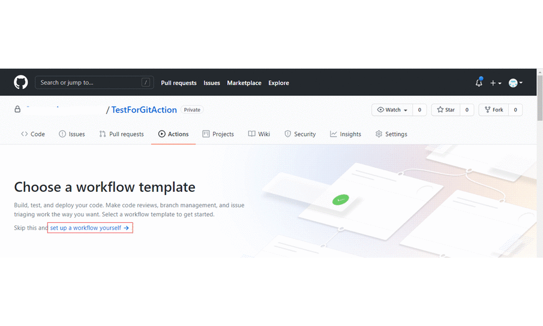
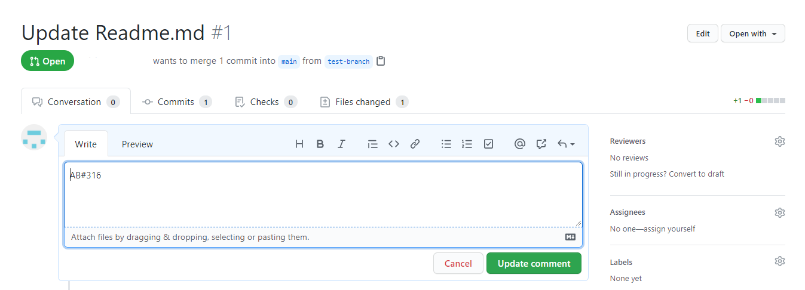

# Update work item state when PR is merged

Update work item state in Azure DevOps :repeat: when the pull request is merged. 

	

## What Does it do

When a pull request is merged to the target branch, the action will trigger a workflow to update the linked work items state to its next state. For example, if the Work Item's state is in **ToDo**, the work item's state will change to **doing**. The action supports both default and custom process templates as well.

## Supported Pull Request :arrows_clockwise: States

The action currently supports **closed** state. Support for other pull request states will be added soon.

## Prerequisites

- Azure DevOps account
- Azure DevOps PAT
- GitHub Account
- GitHub PAT
- Install the [Azure Boards App](https://docs.microsoft.com/en-us/azure/devops/boards/github/install-github-app?view=azure-devops) from GitHub Marketplace

## Example Usage

1. Add the following as [GitHub secrets](https://docs.github.com/en/free-pro-team@latest/actions/reference/encrypted-secrets#creating-encrypted-secrets-for-a-repository) in your repository.

    - Azure DevOps PAT 
    - GitHub PAT
    - Azure DevOps Organization 
    - Azure DevOps Project

2. Other Input Parameters

    - **closedstate**- This Parameter is **required** for the action to check the workitem state. If the target workitem's state is closed, the action will quit. This is to ensure that a closed work item is not linked to a pull request.

    - **gh_repo, gh_repo_owner**- These details are required to get the latest pull request details	

    - **pull_number**- value of this parameter is obtained from the GitHub event **${{github.event.number}}**


### WorkFlow Process

1. Get the Work Item Id

   - With the github repository inputs, a request is sent to the pull request api endpoint to get the complete pull request details
   - From the pull request details the work item id is retrieved

2. Update the Work Item State

   - With the Work Item and the ADO Project Name, the work item states associated with the Project are pulled. 
   - At first, the check will be done whether the work item is in closed state. If not, the workitem state is updated to the next state.

### Link the Work Item

The work Item Id must be prefixed with AB and added as AB#[Workitem Id] in the Pull request body.


   
### Sample WorkFlow File 

```yml
name: Update work item state when PR is merged

on:
   pull_request:
    branches: [master]
    types: [closed]

jobs:
  alert:
    runs-on: ubuntu-latest
    steps:       
    - uses: CanarysAutomations/pr-update-work-item-state@master
      env: 
        gh_token : '${{ secrets.GH_TOKEN }}'   
        ado_token: '${{ secrets.ADO_PERSONAL_ACCESS_TOKEN }}'
        ado_organization: '${{ secrets.ADO_ORGANIZATION }}'
        ado_project: '${{ secrets.ADO_PROJECT }}'
        closedstate: ''
        gh_repo_owner: ''
        gh_repo: ''
        pull_number: ${{github.event.number}} 
```
   


